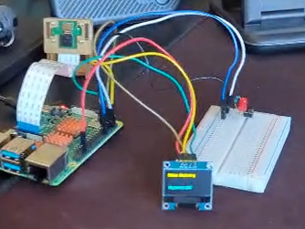

# Pose Estimation
I built a pose-tracking device using a Raspberry Pi, a camera, and a machine learning model that detects key points on a person's body — like shoulders, elbows, and knees — in real time. I fixed several hardware issues along the way, including switching to a different camera library for better reliability, and added a small screen that shows live stats like frame rate and how many body points are being detected. Now the device gives instant visual feedback on screen instead of only saving photos you'd have to check later.

```HTML
<!--- This is an HTML comment in Markdown -->
<!--- Anything between these symbols will not render on the published site -->
```

| **Engineer** | **School** | **Area of Interest** | **Grade** |
|:--:|:--:|:--:|:--:|
| Pranav G | Irvington High School | Data Science / CSE | Incoming Senior



  
# Final Milestone


<iframe width="560" height="315" src="https://www.youtube.com/embed/eS6Krnuh100?si=k-Y2pik1kJ2L1Zvb" title="YouTube video player" frameborder="0" allow="accelerometer; autoplay; clipboard-write; encrypted-media; gyroscope; picture-in-picture; web-share" referrerpolicy="strict-origin-when-cross-origin" allowfullscreen></iframe>

For my final milestone, I added a small OLED display to the project, giving it real-time visual feedback instead of only saving results silently to disk. This involved wiring the screen over I2C, troubleshooting a bent GPIO pin, and writing code to show live stats — frame rate, number of body keypoints detected, and system status — directly on the device as it runs. The final result is a fully working, self-contained pose-tracking device that lets you see exactly what it's detecting in real time, right on the hardware itself.


# First Milestone


<iframe width="560" height="315" src="https://www.youtube.com/embed/hFuY0ifRM_0?si=FQZ-E5-gd6A0W1EU" title="YouTube video player" frameborder="0" allow="accelerometer; autoplay; clipboard-write; encrypted-media; gyroscope; picture-in-picture; web-share" referrerpolicy="strict-origin-when-cross-origin" allowfullscreen></iframe>

For my first milestone, I got the core pose estimation system running on the Raspberry Pi, using a TensorFlow Lite PoseNet model to detect body keypoints from a live camera feed. Along the way, I debugged a camera compatibility issue by switching from OpenCV's video capture to the Picamera2 library, then fixed a resulting color tint bug to get accurate images. By the end of this milestone, the system could reliably capture frames, detect body keypoints, and save annotated images to the Pi.

# Schematics 
Here's where you'll put images of your schematics. [Tinkercad](https://www.tinkercad.com/blog/official-guide-to-tinkercad-circuits) and [Fritzing](https://fritzing.org/learning/) are both great resoruces to create professional schematic diagrams, though BSE recommends Tinkercad becuase it can be done easily and for free in the browser. 

# Code

```
# Import packages
import os
import argparse
import cv2
import numpy as np  
import sys
import pdb
import time
import math
import pathlib
from threading import Thread
import importlib.util
import datetime
from picamera2 import Picamera2

import time
import RPi.GPIO as GPIO

GPIO.setmode(GPIO.BCM)
#led
GPIO.setup(4, GPIO.OUT)
#button
GPIO.setup(17, GPIO.IN, pull_up_down=GPIO.PUD_UP)


# Define VideoStream class to handle streaming of video from webcam in separate processing thread
# Source - Adrian Rosebrock, PyImageSearch: https://www.pyimagesearch.com/2015/12/28/increasing-raspberry-pi-fps-with-python-and-opencv/
class VideoStream:
    """Camera object that controls video streaming from Raspberry Pi Camera using Picamera2"""

    def __init__(self, resolution=(640, 480), framerate=30):
        self.picam2 = Picamera2()

        config = self.picam2.create_preview_configuration(
            main={
                "size": resolution,
                "format": "RGB888"
            },
            controls={
                "FrameRate": framerate
            }
        )

        self.picam2.configure(config)
        self.picam2.start()
        time.sleep(1)

        self.frame = self.picam2.capture_array()
        self.stopped = False

        print("PiCamera2 initiated.")

    def start(self):
        return self

    def read(self):
        if self.stopped:
            return None
        self.frame = self.picam2.capture_array()
        return self.frame

    def stop(self):
        self.stopped = True
        self.picam2.stop()

# Define and parse input arguments
parser = argparse.ArgumentParser()
parser.add_argument('--modeldir', help='Folder the .tflite file is located in',
                    required=True)
parser.add_argument('--graph', help='Name of the .tflite file, if different than detect.tflite',
                    default='detect.tflite')
parser.add_argument('--labels', help='Name of the labelmap file, if different than labelmap.txt',
                    default='labelmap.txt')
parser.add_argument('--threshold', help='Minimum confidence threshold for displaying detected keypoints (specify between 0 and 1).',
                    default=0.5)
parser.add_argument('--resolution', help='Desired webcam resolution in WxH. If the webcam does not support the resolution entered, errors may occur.',
                    default='1280x720')
parser.add_argument('--edgetpu', help='Use Coral Edge TPU Accelerator to speed up detection',
                    action='store_true')
parser.add_argument('--output_path', help="Where to save processed imges from pi.",
                    required=True)

args = parser.parse_args()

MODEL_NAME = args.modeldir
GRAPH_NAME = args.graph
LABELMAP_NAME = args.labels
min_conf_threshold = float(args.threshold)
resW, resH = args.resolution.split('x')
imW, imH = int(resW), int(resH)
use_TPU = args.edgetpu

# Import TensorFlow libraries
# If tensorflow is not installed, import interpreter from tflite_runtime, else import from regular tensorflow
# If using Coral Edge TPU, import the load_delegate library
pkg = importlib.util.find_spec('tensorflow')
if pkg is None:
    from tflite_runtime.interpreter import Interpreter
    if use_TPU:
        from tflite_runtime.interpreter import load_delegate
else:
    from tensorflow.lite.python.interpreter import Interpreter
    if use_TPU:
        from tensorflow.lite.python.interpreter import load_delegate

# If using Edge TPU, assign filename for Edge TPU model
if use_TPU:
    # If user has specified the name of the .tflite file, use that name, otherwise use default 'edgetpu.tflite'
    if (GRAPH_NAME == 'detect.tflite'):
        GRAPH_NAME = 'edgetpu.tflite'       

# Get path to current working directory
CWD_PATH = os.getcwd()

# Path to .tflite file, which contains the model that is used for object detection
PATH_TO_CKPT = os.path.join(CWD_PATH,MODEL_NAME)


# If using Edge TPU, use special load_delegate argument
if use_TPU:
    interpreter = Interpreter(model_path=PATH_TO_CKPT,
                              experimental_delegates=[load_delegate('libedgetpu.so.1.0')])
    print(PATH_TO_CKPT)
else:
    interpreter = Interpreter(model_path=PATH_TO_CKPT)
interpreter.allocate_tensors()

# Get model details
input_details = interpreter.get_input_details()
output_details = interpreter.get_output_details()
height = input_details[0]['shape'][1]
width = input_details[0]['shape'][2]
#set stride to 32 based on model size
output_stride = 32

led_on = False
floating_model = (input_details[0]['dtype'] == np.float32)

input_mean = 127.5
input_std = 127.5

def mod(a, b):
    """find a % b"""
    floored = np.floor_divide(a, b)
    return np.subtract(a, np.multiply(floored, b))

def sigmoid(x):
    """apply sigmoid actiation to numpy array"""
    return 1/ (1 + np.exp(-x))
    
def sigmoid_and_argmax2d(inputs, threshold):
    """return y,x coordinates from heatmap"""
    #v1 is 9x9x17 heatmap
    v1 = interpreter.get_tensor(output_details[0]['index'])[0]
    height = v1.shape[0]
    width = v1.shape[1]
    depth = v1.shape[2]
    reshaped = np.reshape(v1, [height * width, depth])
    reshaped = sigmoid(reshaped)
    #apply threshold
    reshaped = (reshaped > threshold) * reshaped
    coords = np.argmax(reshaped, axis=0)
    yCoords = np.round(np.expand_dims(np.divide(coords, width), 1)) 
    xCoords = np.expand_dims(mod(coords, width), 1) 
    return np.concatenate([yCoords, xCoords], 1)

def get_offset_point(y, x, offsets, keypoint, num_key_points):
    """get offset vector from coordinate"""
    y_off = offsets[y,x, keypoint]
    x_off = offsets[y,x, keypoint+num_key_points]
    return np.array([y_off, x_off])
    

def get_offsets(output_details, coords, num_key_points=17):
    """get offset vectors from all coordinates"""
    offsets = interpreter.get_tensor(output_details[1]['index'])[0]
    offset_vectors = np.array([]).reshape(-1,2)
    for i in range(len(coords)):
        heatmap_y = int(coords[i][0])
        heatmap_x = int(coords[i][1])
        #make sure indices aren't out of range
        if heatmap_y >8:
            heatmap_y = heatmap_y -1
        if heatmap_x > 8:
            heatmap_x = heatmap_x -1
        offset_vectors = np.vstack((offset_vectors, get_offset_point(heatmap_y, heatmap_x, offsets, i, num_key_points)))  
    return offset_vectors

def draw_lines(keypoints, image, bad_pts):
    """connect important body part keypoints with lines"""
    #color = (255, 0, 0)
    color = (0, 255, 0)
    thickness = 2
    #refernce for keypoint indexing: https://www.tensorflow.org/lite/models/pose_estimation/overview
    body_map = [[5,6], [5,7], [7,9], [5,11], [6,8], [8,10], [6,12], [11,12]] #, [11,13], [13,15], [12,14], [14,16]]
    #commenting out some of the points to remove points below the waist as the whole body can not be seen in the video.
    for map_pair in body_map:       
        #print(f'Map pair {map_pair}')
        if map_pair[0] in bad_pts or map_pair[1] in bad_pts:
            continue
        start_pos = (int(keypoints[map_pair[0]][1]), int(keypoints[map_pair[0]][0]))
        end_pos = (int(keypoints[map_pair[1]][1]), int(keypoints[map_pair[1]][0]))/ 
        image = cv2.line(image, start_pos, end_pos, color, thickness)
    return image

#flag for debugging
debug = True 

try:
    print("Progam started - waiting for button push...")
    while True:
    #if True:
        #make sure LED is off and wait for button press
        if not led_on and  not GPIO.input(17):
        #if True:
            #timestamp an output directory for each capture
            outdir = pathlib.Path(args.output_path) / time.strftime('%Y-%m-%d_%H-%M-%S-%Z')
            outdir.mkdir(parents=True)
            GPIO.output(4, True)
            time.sleep(.1)
            led_on = True
            f = []

            # Initialize frame rate calculation
            frame_rate_calc = 1
            freq = cv2.getTickFrequency()
            videostream = VideoStream(resolution=(imW,imH),framerate=30).start()
            time.sleep(1)

            #for frame1 in camera.capture_continuous(rawCapture, format="bgr",use_video_port=True):
            while True:
                print('running loop')
                # Start timer (for calculating frame rate)
                t1 = cv2.getTickCount()
                
                # Grab frame from video stream
                frame1 = videostream.read()
                
                if frame1 is None:
                    print("No frame received from camera. Check camera connection/index.")
                    time.sleep(0.1)
                    continue
                # Acquire frame and resize to expected shape [1xHxWx3]
                frame1 = cv2.rotate(frame1, cv2.ROTATE_180)
                frame = frame1.copy()
                # Picamera2 with RGB888 already gives RGB frames
                frame_rgb = frame
                frame_resized = cv2.resize(frame_rgb, (width, height))
                
                input_data = np.expand_dims(frame_resized, axis=0)
                
                #frame_resized = cv2.cvtColor(frame_resized, cv2.COLOR_BGR2RGB)

                # Normalize pixel values if using a floating model (i.e. if model is non-quantized)
                if floating_model:
                    input_data = (np.float32(input_data) - input_mean) / input_std

                # Perform the actual detection by running the model with the image as input
                interpreter.set_tensor(input_details[0]['index'],input_data)
                interpreter.invoke()
                
                #get y,x positions from heatmap
                coords = sigmoid_and_argmax2d(output_details, min_conf_threshold)
                #keep track of keypoints that don't meet threshold
                drop_pts = list(np.unique(np.where(coords ==0)[0]))
                #get offets from postions
                offset_vectors = get_offsets(output_details, coords)
                #use stide to get coordinates in image coordinates
                keypoint_positions = coords * output_stride + offset_vectors
                
                print("coords:", coords)
                print("keypoints:", keypoint_positions)
                print("drop_pts:", drop_pts)
                
                # Loop over all detections and draw detection box if confidence is above minimum threshold
                for i in range(len(keypoint_positions)):
                    #don't draw low confidence points
                    if i in drop_pts:
                        continue
                    # Center coordinates
                    x = int(keypoint_positions[i][1])
                    y = int(keypoint_positions[i][0])
                    center_coordinates = (x, y)
                    radius = 2
                    color = (0, 255, 0)
                    thickness = 2
                    cv2.circle(frame_resized, center_coordinates, radius, color, thickness)
                    if debug:
                        cv2.putText(frame_resized, str(i), (x-4, y-4), cv2.FONT_HERSHEY_SIMPLEX, 0.7, (0, 255, 0), 1) # Draw label text
     
                frame_resized = draw_lines(keypoint_positions, frame_resized, drop_pts)

                # Draw framerate in corner of frame - remove for small image display
                #cv2.putText(frame,'FPS: {0:.2f}'.format(frame_rate_calc),(30,50),cv2.FONT_HERSHEY_SIMPLEX,1,(255,255,0),2,cv2.LINE_AA)
                #cv2.putText(frame_resized,'FPS: {0:.2f}'.format(frame_rate_calc),(30,50),cv2.FONT_HERSHEY_SIMPLEX,1,(255,255,0),2,cv2.LINE_AA)

                # Calculate framerate
                t2 = cv2.getTickCount()
                time1 = (t2-t1)/freq
                frame_rate_calc= 1/time1
                f.append(frame_rate_calc)
    
                #save image with time stamp to directory
                #path = str(outdir) + '/'  + str(datetime.datetime.now()) + ".jpg"

                #status = cv2.imwrite(path, frame_resized)
                cv2.imshow("Pose Estimation", frame_resized)
                # Press 'q' to quit
                if cv2.waitKey(1) == ord('q') or led_on and not GPIO.input(17):
                    print(f"Saved images to: {outdir}")
                    GPIO.output(4, False)
                    led_on = False
                    # Clean up
                    cv2.destroyAllWindows()
                    videostream.stop()
                    time.sleep(2)
                    break

except KeyboardInterrupt:
    # Clean up
    cv2.destroyAllWindows()
    videostream.stop()
    print('Stopped video stream.')
    GPIO.output(4, False)
    GPIO.cleanup()
    #print(str(sum(f)/len(f)))
```

# Bill of Materials

| **Part** | **Note** | **Price** | **Link** |
|:--:|:--:|:--:|:--:|
| Raspberry Pi 4 Starter Kit | Computing | $149 | <a href="[https://www.amazon.com/Arduino-A000066-ARDUINO-UNO-R3/dp/B008GRTSV6](https://www.amazon.com/RasTech-Raspberry-Starter-Heatsink-Screwdriver/dp/B0C8LV6VNZ/ref=sr_1_3?crid=2LSCXAYVEND7R&dib=eyJ2IjoiMSJ9.VmzHyLmBoYHzxIFtnWbp5P46ovZnz40k9gjFe9rZ0RcEPpkipFreTI-HormqxLXDApvl8921zFN7_RtLChz7gvjkAvd9sXryp5u32gi9jMPsAGx_PqW7CV2z4C925pBi8c-ndO-FdMupX-mTm-I5KEJEg42FwWlXnMK-5XkA5qE1gZfvv7epVYjHd8dpfFX2qpJrR8IOuapFCWP1vfGFMXbDdNlS1i558lxPGB8BISQ.9SNnBJRO2-iAf6iXGLRa-bfHFQpR68AyJDooPtHtiiE&dib_tag=se&keywords=rastech%2B4gb%2Bram&qid=1782846833&sprefix=rastech%2B4gb%2Bram%2Caps%2C179&sr=8-3&th=1)"> Link </a> |
| ELEGOO OLED Display | Display | $10 | <a href="[https://www.amazon.com/Arduino-A000066-ARDUINO-UNO-R3/dp/B008GRTSV6/](https://a.co/d/0h0vKpFw)"> Link </a> |
| Smraza Basic Starter Kit | Hardware | $12 | <a href="[https://www.amazon.com/Arduino-A000066-ARDUINO-UNO-R3/dp/B008GRTSV6/](https://www.amazon.com/dp/B01HRR7EBG?lv=shuf&_encoding=UTF8&social_share=cm_sw_r_cp_ud_dp_2HHPHANZD0NNWEPZRNMH&channelId=751&ref_=cm_sw_r_cp_ud_dp_2HHPHANZD0NNWEPZRNMH&plpRedirect=mhFallback&th=1)"> Link </a> |

# Other Resources/Examples
One of the best parts about Github is that you can view how other people set up their own work. Here are some past BSE portfolios that are awesome examples. You can view how they set up their portfolio, and you can view their index.md files to understand how they implemented different portfolio components.
- [Example 1](https://trashytuber.github.io/YimingJiaBlueStamp/)
- [Example 2](https://sviatil0.github.io/Sviatoslav_BSE/)
- [Example 3](https://arneshkumar.github.io/arneshbluestamp/)

To watch the BSE tutorial on how to create a portfolio, click here.
